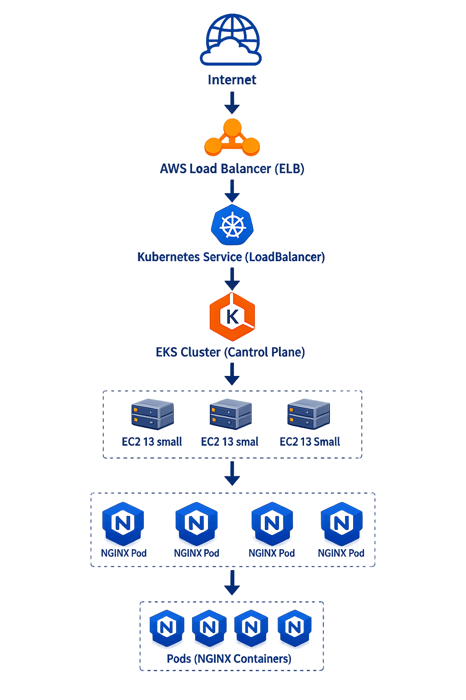
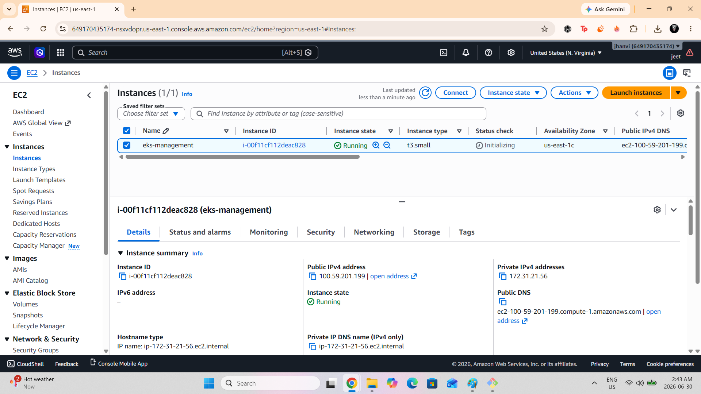
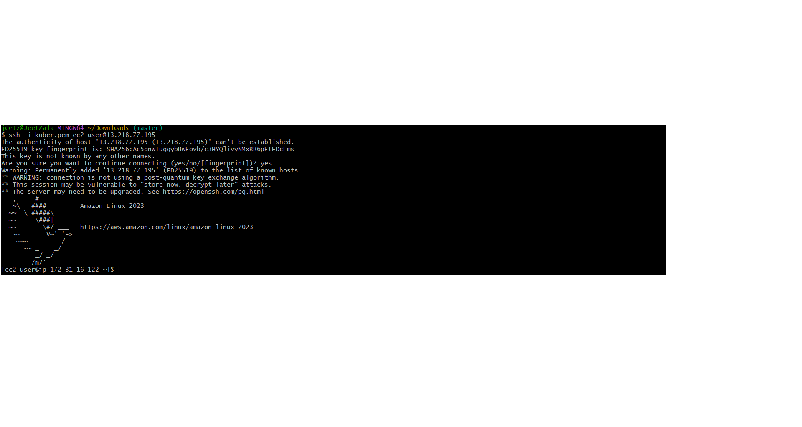

# 🚀 AWS Project – Amazon EKS Kubernetes Deployment

---

## 📌 Project Overview

This project demonstrates **a complete Kubernetes deployment on AWS using Amazon EKS**.

It includes provisioning an EKS cluster, deploying a containerized application, exposing it via **a LoadBalancer, performing scaling operations, executing rolling updates, and cleaning up all AWS resources**.

---

## 🏗️ Architecture Diagram

---

## 🛠️ Technologies Used

- Amazon EKS (Elastic Kubernetes Service)
- EC2 (t3.small worker nodes)
- IAM (Roles & Permissions)
- Kubernetes (kubectl)
- eksctl
- Docker (container runtime)
- AWS CLI
- NGINX container

---

## 🎯 Objectives

- Create and manage Kubernetes cluster using EKS
- Deploy containerized application (NGINX)
- Expose application using LoadBalancer service
- Perform scaling operations
- Execute rolling updates
- Learn Kubernetes lifecycle management

---

# ⚙️ Step-by-Step Implementation

### 1️⃣ EC2 Management Instance Setup

- Created EC2 instance (eks-management)
- Installed required tools:
- kubectl
- eksctl
- AWS CLI
- Docker
- Git

---

### 2️⃣ SSH Connection to EC2

Connected to instance using PEM key.

---

### 3️⃣ Tool Installation Verification

Verified installed tools:

kubectl
eksctl
aws cli

📸 Screenshot:

03-tools-installed.png
4️⃣ Create EKS Cluster

Command used:

eksctl create cluster \
--name eks-project-11 \
--region us-east-1 \
--nodegroup-name worker-nodes \
--node-type t3.small \
--nodes 2 \
--nodes-min 1 \
--nodes-max 3 \
--managed

📸 Screenshot:

04-eks-cluster-created.png
5️⃣ Verify Cluster Nodes
kubectl get nodes

📸 Screenshot:

05-kubectl-nodes-ready.png
6️⃣ Deploy NGINX Application

Created deployment:

nginx:latest
replicas: 2

Applied using:

kubectl apply -f deployment.yaml

📸 Screenshot:

06-pods-running.png
7️⃣ Expose Application via LoadBalancer
kubectl expose deployment nginx-deployment \
--type=LoadBalancer \
--name=nginx-service \
--port=80

📸 Screenshot:

07-loadbalancer-service.png
8️⃣ Access Application in Browser

Accessed using LoadBalancer DNS.

Displayed default NGINX page.

📸 Screenshot:

08-nginx-browser-output.png
9️⃣ Scaling Test

Scaled deployment:

kubectl scale deployment nginx-deployment --replicas=4

📸 Screenshot:

09-pods-scaling-4-replicas.png
🔟 Rolling Update

Updated image:

nginx:1.25

Verified rollout:

kubectl rollout status deployment nginx-deployment

📸 Screenshot:

10-rolling-update-success.png
1️⃣1️⃣ Final Application Verification

Confirmed application still running after update.

📸 Screenshot:

11-app-working-after-rolling-update.png
🧹 Cleanup Steps

To avoid AWS charges:

kubectl delete svc nginx-service
kubectl delete deployment nginx-deployment
eksctl delete cluster --name eks-project-11 --region us-east-1

Also terminated EC2 instance.

📚 Key Learnings
Amazon EKS cluster creation
Kubernetes deployments & services
LoadBalancer exposure
Scaling applications
Rolling updates in Kubernetes
AWS CLI + eksctl workflow
Cloud resource cleanup
🏁 Project Outcome

Successfully deployed a fully functional Kubernetes application on AWS EKS, demonstrating production-level DevOps and cloud engineering skills.

🚀 Status

✔ Project Completed
✔ All AWS resources cleaned
✔ Ready for portfolio

